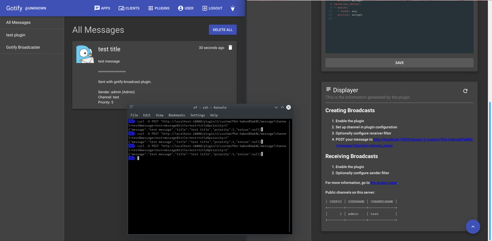

# gotify-broadcast

A plugin which brings broadcasts to gotify.

## Screenshot



## Installation

If you found your gotify version is included in the build, you can download the shared object and put that into your plugin dir.

If you did not find you gotify version, follow these steps to build one for your own:

1. Download a zip file of the source code of current release at the releases page and extract it.
1. `export GO111MODULE=on` if you are in GOPATH
1. `make download-tools`
1. `make GOTIFY_VERSION=v1.2.1 build` to build the plugin for your gotify version (`GOTIFY_VERSION` could be a tag, a branch or a commit).

## Configuration

The configuration contains three keys: `channels`, `sender_filter`, and `receiver_filter`.

### Channels

The `channels` key in the configuration describes which channels you are using. Each channen has two parameters: `name` and `public`.

The `name` parameter is used to identify the channel. It must be unique and is required while sending broadcasts.

The `public` parameter specifies whether this channel will be visible to other users in the `Displayer` panel in their WebUI. If this is set to `false`, they will not be able to see this channel on the WebUI, but they can still recieve messages from this broadcast. Thus, it is recommended to set a receiver filter which defaults to `Reject` on private channels.

```yaml
channels:
- name: example_public_channel
  public: true
- name: example_private_channel
  public: false
```

### Filters

In order to control from which and to which a broadcast is sent, a filter system is integrated into this plugin.

#### The Matching Routine

Messages are filtered with a iptables-like filter system. The filter is a chain of [Rules](https://godoc.org/github.com/eternal-flame-AD/gotify-broadcast/rules/#Rule), which contains a [match](https://godoc.org/github.com/eternal-flame-AD/gotify-broadcast/rules/#MatchSet) describing how this rule matches messages, and a [action](https://godoc.org/github.com/eternal-flame-AD/gotify-broadcast/rules/#Action) describing the action to take when this rule matches successfully.

```yaml
receiver_filter:
  - match:
    - mode: <mode>
      <param>: <param>
    - mode: <mode>
      <param>: <param>
    action: <action>
  - match:
    - mode: <mode>
      <param>: <param>
    - mode: <mode>
      <param>: <param>
    action: <action>
  - match:
    - mode: <mode>
      <param>: <param>
    - mode: <mode>
      <param>: <param>
    action: <action>
sender_filter:
  - match:
    - mode: <mode>
      <param>: <param>
    - mode: <mode>
      <param>: <param>
    action: <action>
  - match:
    - mode: <mode>
      <param>: <param>
    - mode: <mode>
      <param>: <param>
    action: <action>
  - match:
    - mode: <mode>
      <param>: <param>
    - mode: <mode>
      <param>: <param>
    action: <action>
```

All modes and its parameter requirements is documented [here](https://godoc.org/github.com/eternal-flame-AD/gotify-broadcast/rules/#Mode)

#### On the sender side
When a broadcast is created, the `receiver_filter` will be applied to each recipient. Similar to the `OUTPUT` chain in iptables, when the filter evaluates to `Accept`, the message is sent to that recipient (but whether the message is actually received also depends on the configuration of the `sender_filter` filter on the recipient side)
```
                 +--------------------------------------------------------+
                 |                  Outgoing Message                      |
                 |                                                        |
                 +---------------------------+----------------------------+
                                             |
                                             |
+--------------------------------------------+
|
|
|
|           +----------------+       +-----------------+       +-----------------+
|           |                |       |                 |       |                 |
|           |  +----------+  |       |  +-----------+  |       |  +-----------+  |           +-----------------+
|           |  |          |  |   N   |  |           |  |   N   |  |           |  |    N      |                 |
+-------------->   Match  +------------->   Match   +------------->   Match   +--------------> Default: Accept |
            |  |          |  |       |  |           |  |       |  |           |  |           |                 |
            |  +----+-----+  |       |  +-----+-----+  |       |  +-----+-----+  |           +-----------------+
            |       |        |       |        |        |       |        |        |
            |       |Y       |       |        |        |       |        |        |
            |       |        |       |        |        |       |        |        |
            |  +----v-----+  |       |        |        |       |        |        |
            |  |          |  |       |        |        |       |        |        |
            |  |   Match  |  |       |        |        |       |        |        |
            |  |          |  |       |        |        |       |        |        |
            |  +----+-----+  |       |        |        |       |        |        |
            |       |        |       |        |Y       |       |        |Y       |
            |       |        |       |        |        |       |        |        |
            |       |        |       |        |        |       |        |        |
            |       |        |       |        |        |       |        |        |
            |       |Y       |       |        |        |       |        |        |
            |       |        |       |        |        |       |        |        |
            |       |        |       |        |        |       |        |        |
            |       |        |       |        |        |       |        |        |
            |       |        |       |        |        |       |        |        |
            |  +----v-----+  |       |  +-----v-----+  |       |  +-----v-----+  |
            |  |  Accept  |  |       |  |   Reject  |  |       |  |   Reject  |  |
            |  |          |  |       |  |           |  |       |  |           |  |
            |  +----------+  |       |  +-----------+  |       |  +-----------+  |
            |                |       |                 |       |                 |
            +----------------+       +-----------------+       +-----------------+
             receiver_filter[0]       receiver_filter[1]        receiver_filter[2]
```

##### Examples

Only sends broadcast from a channel to admin:
```yaml
channels:
- name: secret
  public: false
receiver_filter:
- match:
  - mode: channel_name
    channel_name: secret
  - mode: is_admin
    is_admin: false
  action: reject
```

Don't send broadcast with priority less than a specified value to some user:
```yaml
receiver_filter:
- match:
  - mode: user_name
    user_name: someone_who_does_not_want_to_be_bothered
  - mode: priority_lt
    priority: 5
  action: reject
```

Don't send broadcast except to `tom` and `jerry`:
```yaml
receiver_filter:
- match:
  - mode: user_name
    user_name: tom
  action: accept
- match:
  - mode: user_name
    user_name: jerry
  action: accept
- match:
  - mode: any
  action: reject
```

Mute broadcasts sent by myself:
```yaml
receiver_filter:
- match:
  - mode: user_name
    user_name: <my_user_name>
  action: reject
```

#### On the receiver side

When a broadcast is received, the `sender_filter` will be applied, similar to the `INPUT` chain in iptables. When this also evaluates to `Accept`, the message is eventually delivered.
```
                 +--------------------------------------------------------+
                 |                  Incoming Message                      |
                 |                                                        |
                 +---------------------------+----------------------------+
                                             |
                                             |
+--------------------------------------------+
|
|
|
|           +----------------+       +-----------------+       +-----------------+
|           |                |       |                 |       |                 |
|           |  +----------+  |       |  +-----------+  |       |  +-----------+  |           +-----------------+
|           |  |          |  |   N   |  |           |  |   N   |  |           |  |    N      |                 |
+-------------->   Match  +------------->   Match   +------------->   Match   +--------------> Default: Accept |
            |  |          |  |       |  |           |  |       |  |           |  |           |                 |
            |  +----+-----+  |       |  +-----+-----+  |       |  +-----+-----+  |           +-----------------+
            |       |        |       |        |        |       |        |        |
            |       |Y       |       |        |        |       |        |        |
            |       |        |       |        |        |       |        |        |
            |  +----v-----+  |       |        |        |       |        |        |
            |  |          |  |       |        |        |       |        |        |
            |  |   Match  |  |       |        |        |       |        |        |
            |  |          |  |       |        |        |       |        |        |
            |  +----+-----+  |       |        |        |       |        |        |
            |       |        |       |        |Y       |       |        |Y       |
            |       |        |       |        |        |       |        |        |
            |       |        |       |        |        |       |        |        |
            |       |        |       |        |        |       |        |        |
            |       |Y       |       |        |        |       |        |        |
            |       |        |       |        |        |       |        |        |
            |       |        |       |        |        |       |        |        |
            |       |        |       |        |        |       |        |        |
            |       |        |       |        |        |       |        |        |
            |  +----v-----+  |       |  +-----v-----+  |       |  +-----v-----+  |
            |  |  Accept  |  |       |  |   Reject  |  |       |  |   Reject  |  |
            |  |          |  |       |  |           |  |       |  |           |  |
            |  +----------+  |       |  +-----------+  |       |  +-----------+  |
            |                |       |                 |       |                 |
            +----------------+       +-----------------+       +-----------------+
             sender_filter[0]         sender_filter[1]           sender_filter[2]
```

##### Examples

Reject messages which matches a regexp from `my_server`:
```yaml
sender_filter:
- match:
  - mode: user_name
    user_name: my_server
  - mode: message_text
    regex: true
    message_text: ^\[(INFO|DEBUG)\]
  action: reject
```

Reject messages from non-admins but `my_friend`:
```yaml
sender_filter:
- match:
  - mode: user_name
    user_name: my_friend
  action: accept
- match:
  - mode: is_admin
    is_admin: false
  action: reject
```

Reject all received broadcasts:
```yaml
sender_filter:
- match:
  - mode: any
  action: reject
```

## Sending messages

1. Go to the WebUI, configure channels and filters.

2. On the `Displayer` panel, you could see the message hook URL.

3. POST your message to that hook URL just like how to push regular messages with an extra query parameter `channel=<channel_name>`